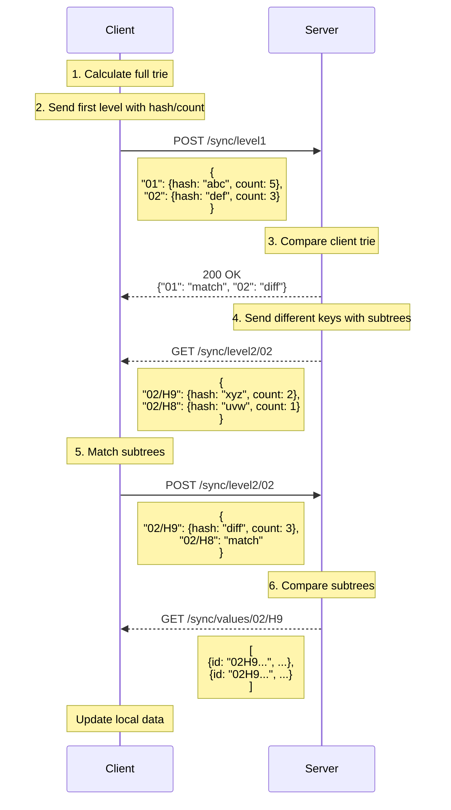

# Client-Server Synchronization Sequence



## Explanation

1. **Client Calculates Full Trie**
   - Client builds complete trie structure
   - Each node contains hash and count

2. **Client Sends First Level**
   - Sends only top-level nodes (2-char prefixes)
   - Includes hash and count for each node
   - Example: `{"01": {hash: "abc", count: 5}}`

3. **Server Comparison**
   - Server compares hashes and counts
   - Identifies which nodes need synchronization
   - Returns list of matching/different nodes

4. **Server Sends Subtree Info**
   - For each different node, sends its subtree
   - Only sends hash and count for each subtree node
   - Example: `{"02/H9": {hash: "xyz", count: 2}}`

5. **Client Matches Subtrees**
   - Client compares subtree hashes and counts
   - Identifies which subtrees need full data
   - Sends back list of different subtrees

6. **Server Sends Full Values**
   - For each different subtree, sends complete data
   - Includes all object details
   - Example: `[{id: "02H9...", ...}]`

## Server-Side Comparison Logic

### First Level Comparison
```typescript
interface FirstLevelNode {
    hash: string;
    count: number;
}

interface ComparisonResult {
    [key: string]: 'match' | 'diff';
}

function compareFirstLevel(
    clientTrie: Record<string, FirstLevelNode>,
    serverTrie: Record<string, FirstLevelNode>
): ComparisonResult {
    const result: ComparisonResult = {};

    // Check all client nodes against server
    for (const [key, clientNode] of Object.entries(clientTrie)) {
        const serverNode = serverTrie[key];
        
        if (!serverNode) {
            result[key] = 'diff';
            continue;
        }

        // Compare hash and count
        if (clientNode.hash === serverNode.hash && 
            clientNode.count === serverNode.count) {
            result[key] = 'match';
        } else {
            result[key] = 'diff';
        }
    }

    // Check for server nodes not in client
    for (const key of Object.keys(serverTrie)) {
        if (!(key in clientTrie)) {
            result[key] = 'diff';
        }
    }

    return result;
}
```

### Second Level Comparison
```typescript
interface SecondLevelNode {
    hash: string;
    count: number;
}

interface SecondLevelComparison {
    [key: string]: 'match' | 'diff';
}

function compareSecondLevel(
    clientSubtree: Record<string, SecondLevelNode>,
    serverSubtree: Record<string, SecondLevelNode>
): SecondLevelComparison {
    const result: SecondLevelComparison = {};

    // Check all client nodes against server
    for (const [key, clientNode] of Object.entries(clientSubtree)) {
        const serverNode = serverSubtree[key];
        
        if (!serverNode) {
            result[key] = 'diff';
            continue;
        }

        // Compare hash and count
        if (clientNode.hash === serverNode.hash && 
            clientNode.count === serverNode.count) {
            result[key] = 'match';
        } else {
            result[key] = 'diff';
        }
    }

    // Check for server nodes not in client
    for (const key of Object.keys(serverSubtree)) {
        if (!(key in clientSubtree)) {
            result[key] = 'diff';
        }
    }

    return result;
}
```

## Benefits
- Minimizes data transfer by only sending differences
- Uses hash comparison to quickly identify changes
- Hierarchical approach reduces network traffic
- Count validation ensures data integrity 